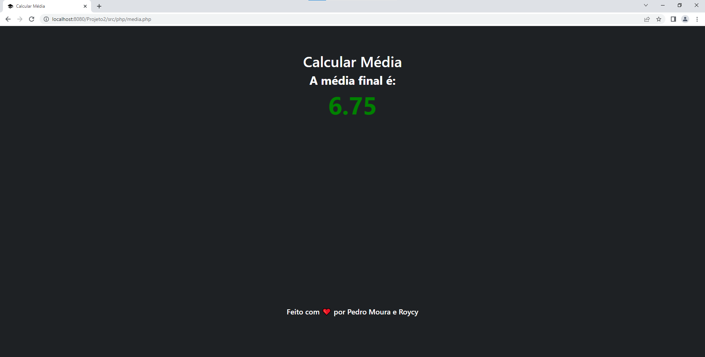

# CalcularMediaPHP
### ⇒ Um código criado em PHP para calcular a média aritmética de quatro notas!
ㅤ
## Tutorial:
#### 1⁰ Instale o <a href="https://www.apachefriends.org/pt_br/download.html" target="_blank">Xampp</a>:
#### 2⁰ Execute o Xampp e inicie o Apache
#### 3⁰ O seu site será gerado em localhost:8080
#### 4⁰ Mova a pasta do projeto para C:\xampp\htdocs
#### 5⁰ Após isso seu projeto estará em localhost:8080/<nome-pasta>
ㅤ

